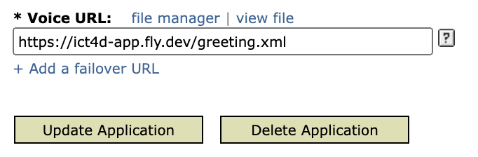

# Improving Cereal Seed Systems in Rural Mali

The app is deployed on [Voxeo](evolution.voxeo.com) (voice browser) / [VXML Tester](https://vxml-tester.kasadaka.com/) and [fly.io](fly.io) (backend).

## Voxeo Deployment

The Voice URL in voxeo config should be https://ict4d-app.fly.dev/greeting.xml .



## VXML Tester Deployment

Upload `entry-for-vxml-tester.xml` and set it as the entry.

## Setup

The deployment includes a Postgres database, whose configuration file is not in this repo since it is an [out-of-the-box database](https://fly.io/docs/postgres/) provided by fly.io.

To connect with the database locally for testing purpose with [flycli](https://fly.io/docs/flyctl/) (assume the database is named as `ict4d-db`):

```shell
fly postgres connect -a ict4d-db
```

## Structure

The application flow:


